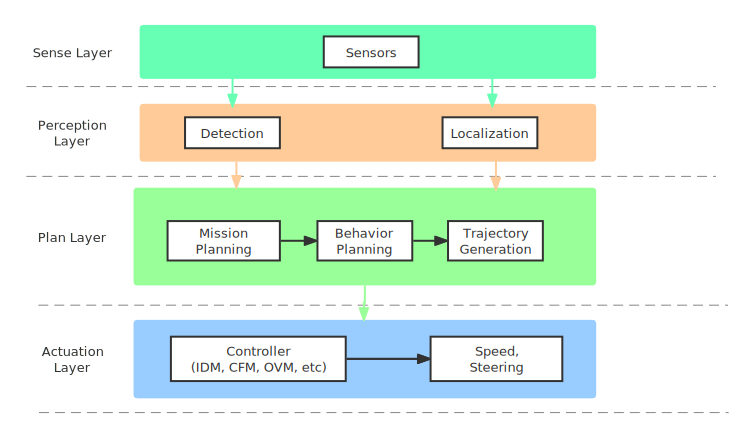

# System Architecture

# Class Section

## Simulation

### Class Definition

| **Class Name** |                        **Definition**                        |
| :------------: | :----------------------------------------------------------: |
|  SensorSystem  |                     Collect sensor data                      |
|   DataCenter   |                         Process data                         |
|     Router     |         Re-route the vehicle in certain road network         |
|   Controller   | Control the vehicle, including steering, accelerating and braking |
|      Env       | Provide interface for interacting with various aspects of a traffic simulation |
|    NetWork     | Specify features of a network,  including the positions of nodes, properties of the edges, and junctions connecting these nodes, properties of vehicles and traffic lights, and other features as well |

### Function Explanation

- SensorSystem

  | **Function Name** | **Explanation** |
  | :------------:| :--------------------------:|
  |add_new_sensor(self, detect_type, sensor_name, noise_function=generate_no_noise)| Add new sensor to the SensorSystem |
  |detect_sensor_data_from_env(self, env, veh_id, detect_type)| Return sensor data from Env|
  |get_sensors(self)| Return all sensors |
  |get_fuse_function(self)| Return sensor fuse function |
  | get_detect_types(self) | Return types of all sensors |

- DataCenter 

  | Function Name | **Explanation** |
  | :------------:| :--------------------------:|
  | update_data(self, data_center_name, t, veh_id=None,**kwargs)| Update the data named data_center_name of the vehicle with index veh_id at step t in DataCenter |
  | get_data(self, data_center_name, **kwargs) | Get data names data_center_name from DataCenter |

- BaseRouter

  | Function Name | **Explanation** |
  | :------------:| :--------------------------:|
  | choose_route(self, env) | Return the routing method implemented by the controller |

- BaseController

  The detailed explanation is presented in [Controller](#Controller) section.

- Env

  | Function Name | **Explanation** |
  | :------------:| :--------------------------:|
  | restart_simulation(self, sim_params, render=None) | Restart an already initialized simulation instance |
  | setup_initial_state(self) | Store information on the initial state of vehicles in the network |
  | step(self, rl_actions) | Advance the environment by one step |
  | reset(self) | Reset the environment |
  | additional_command(self) | Additional commands that may be performed by the step method |
  | clip_actions(self, rl_actions=None) | Clip the actions passed from the RL agent |
  | apply_rl_actions(self, rl_actions=None) | Specify the actions to be performed by the rl agent(s) |
  | compute_reward(self, rl_actions, **kwargs) | Reward function for the RL agent(s) |
  | terminate(self) | Close the TraCI I/O connection |
  | render(self, reset=False, buffer_length=5) | Render a frame |
  | pyglet_render(self) | Render a frame using pyglet |
  | get_state(self) | Return the state of the simulation as perceived by the RL agent |
  | action_space(self) | Identify the dimensions and bounds of the action space |
  | observation_space(self) | Identify the dimensions and bounds of the observation space |

- NetWork

  | Function Name | **Explanation** |
  | :------------:| :--------------------------:|
  | specify_edge_starts(self) | Define edge starts for road sections in the network |
  | specify_internal_edge_starts(self) | Define the edge starts for internal edge nodes |
  | specify_nodes(self, net_params) | Specify the attributes of nodes in the network |
  | specify_edges(self, net_params) | Specify the attributes of edges connecting pairs on nodes |
  | specify_types(self, net_params) | Specify the attributes of various edge types (if any exist) |
  | specify_connections(self, net_params) | Specify the attributes of connections |
  | specify_routes(self, net_params) | Specify the routes vehicles can take starting from any edge |

## 
Controller

We adopt four different typical controller to evaluate the impact of noise.

We use IDMController and BandoFTLController to validate the effectiveness of our proposed margin in terms of traffic throughput and safety. 

## Experiment

Gaussian noise with $\mu=5$

[video](pic_readme/gaussian_5.mp4)

Simulation with noise and without noise result:

Untrained model:

[video](pic_readme/gaussian_5_untrained.mp4)

https://github.com/swsamleo/ComDrive/edit/master/pic_readme/gaussian_5_untrained.mp4

Trained model:

[video](pic_readme/gaussian_5_train.mp4)
